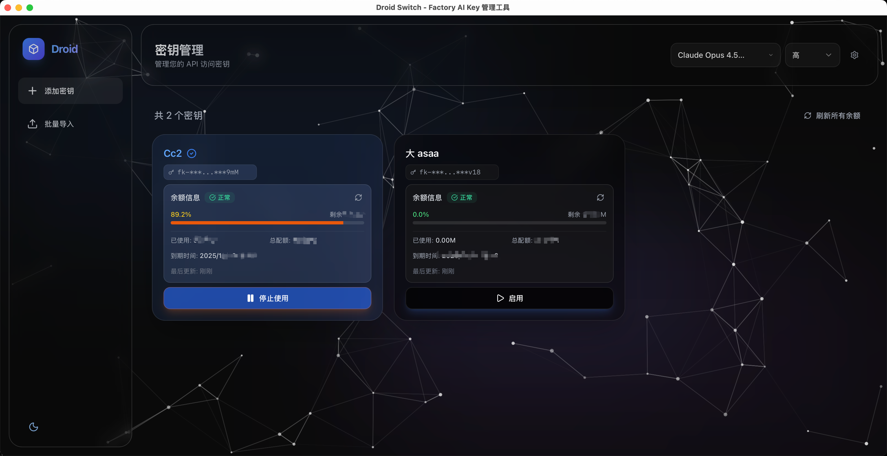

<p align="center">
  
</p>

<h1 align="center">Droid Switch</h1>

<p align="center">
  <strong>一款现代化的 Factory AI API 密钥管理桌面应用</strong>
</p>

<p align="center">
  <a href="./README.md">English</a> •
  <a href="#功能特性">功能特性</a> •
  <a href="#安装方法">安装方法</a> •
  <a href="#使用说明">使用说明</a> •
  <a href="#贡献指南">贡献指南</a>
</p>

<p align="center">
  
  
  
</p>

---

## 项目简介

Droid Switch 是一款基于 Tauri 和 React 构建的跨平台桌面应用程序，旨在简化多个 Factory AI API 密钥的管理工作。它提供了便捷的密钥切换、余额查询和环境变量管理功能。

## 功能特性

- **多密钥管理** - 支持添加、删除和管理多个 API 密钥
- **一键切换** - 快速激活任意 API 密钥
- **余额监控** - 实时显示配额使用情况和剩余额度
- **批量导入** - 支持批量导入多个 API 密钥
- **模型选择** - 支持内置模型和自定义模型，可配置推理级别
- **配置管理** - 自动管理 Factory 配置文件
- **系统托盘** - 通过系统托盘快速访问，支持右键菜单
- **跨平台支持** - 原生支持 Windows、macOS 和 Linux
- **现代化界面** - 基于 React 19 和 Tailwind CSS 构建的简洁响应式界面

## 截图预览

<p align="center">
  
  <br>
  <em>主界面 - API 密钥管理</em>
</p>

## 安装方法

### 环境要求

- **Node.js** v18 或更高版本
- **pnpm**（推荐）
  ```bash
  npm install -g pnpm
  ```
- **Rust** 1.70 或更高版本
  ```bash
  curl --proto '=https' --tlsv1.2 -sSf https://sh.rustup.rs | sh
  ```

### 从源码构建

```bash
# 克隆仓库
git clone https://github.com/zhiNians/factory-ai-droid-switch.git
cd factory-ai-droid-switch

# 安装依赖
pnpm install

# 开发模式运行
pnpm tauri dev

# 构建生产版本
pnpm tauri build
```

构建完成后，安装包位于 `src-tauri/target/release/bundle/` 目录。

### 下载预编译版本

> 预编译版本将在 [Releases](https://github.com/zhiNians/factory-ai-droid-switch/releases) 页面提供下载。

## 使用说明

### 管理 API 密钥

1. **添加密钥** - 点击"添加密钥"按钮，输入名称和 API 密钥
2. **激活密钥** - 点击密钥卡片上的"激活"按钮，将其设为当前使用的密钥
3. **停用密钥** - 点击"停用"按钮清除激活的密钥
4. **删除密钥** - 点击删除按钮移除密钥

### 批量导入

1. 点击"批量导入"按钮
2. 输入名称前缀（例如："密钥"）
3. 每行粘贴一个 API 密钥
4. 点击"导入"

密钥将自动命名（例如："密钥 1"、"密钥 2" 等）

### 模型选择

- 使用顶部导航栏的模型选择器选择您偏好的 AI 模型
- 为每个模型配置推理级别（关闭、低、中、高）
- 通过模型管理界面添加自定义模型

### 工作原理

Droid Switch 通过以下方式管理 API 密钥：
1. 将激活的 API 密钥写入 `~/.factory/config.json`
2. 安装 shell 包装函数，在运行 `droid` 命令时自动加载密钥

无需手动配置环境变量 - 只需激活密钥并重启 `droid` 会话即可。

## 技术栈

### 前端
- React 19 + TypeScript
- Vite
- Tailwind CSS v4
- Lucide React 图标库
- Framer Motion 动画库

### 后端
- Rust
- Tauri 2.x
- reqwest（HTTP 客户端）
- serde_json

## 项目结构

```
factory-ai-droid-switch/
├── src/                    # 前端源代码
│   ├── components/         # React 组件
│   ├── hooks/              # 自定义 Hooks
│   ├── lib/                # 工具函数
│   └── types/              # TypeScript 类型定义
├── src-tauri/              # Tauri 后端（Rust）
│   ├── src/                # Rust 源代码
│   └── tauri.conf.json     # Tauri 配置
├── public/                 # 静态资源
└── package.json            # 依赖配置
```

## 配置文件

配置文件位置：
- **Windows**：`C:\Users\{用户名}\.factory-ai-droid-switch\config.json`
- **macOS**：`/Users/{用户名}/.factory-ai-droid-switch/config.json`
- **Linux**：`/home/{用户名}/.factory-ai-droid-switch/config.json`

## 常见问题

### 切换密钥后没有生效？

只需重启您的 `droid` 会话，新密钥会自动从 `~/.factory/config.json` 加载。

### 余额查询失败？

请检查：
1. API 密钥是否正确
2. 网络连接是否正常
3. Factory AI 服务是否可用

## 贡献指南

欢迎提交 Issue 和 Pull Request！

1. Fork 本仓库
2. 创建特性分支（`git checkout -b feature/AmazingFeature`）
3. 提交更改（`git commit -m 'Add some AmazingFeature'`）
4. 推送到分支（`git push origin feature/AmazingFeature`）
5. 开启 Pull Request

## 许可证

本项目采用 MIT 许可证 - 详见 [LICENSE](LICENSE) 文件。

## 致谢

- [Tauri](https://tauri.app/) - 桌面应用框架
- [React](https://react.dev/) - 前端框架
- [Tailwind CSS](https://tailwindcss.com/) - CSS 框架
- [Lucide](https://lucide.dev/) - 图标库
- [Factory AI](https://factory.ai/) - API 服务提供商

---

<p align="center">用 ❤️ 制作 by <a href="https://github.com/zhiNians">zhiNian</a></p>
